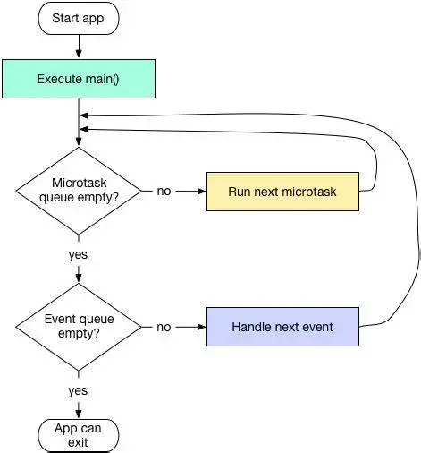

# Flutter

## Dart语法中dynamic，var，object三者的区别

- var定义的类型是不可变的
- dynamic和object类型是可以变的，而dynamic 与object 的最大的区别是在静态类型检查上

## const和final的区别

### 相同点

- 必须初始化
- 只能赋值一次

### 不同点

- final可修饰实例变量、const不可以修饰实例变量
- 访问类中const修饰的变量需要static修饰
- const修饰的List集合任意索引不可修改，final修饰的可以修改
- const 用来修饰变量 只能被赋值一次，在编译时赋值 final 用来修饰变量 只能被赋值一次，在运行时赋值
- final 只可用来修饰变量， const 关键字即可修饰变量也可用来修饰 常量构造函数 当const修饰类的构造函数时，它要求该类的所有成员都必须是final的。

## ?? 与 ??= 的区别

### ??

- 左边如果为空返回右边的值，否则不处理。

### ??=

- 左边如果为空把B的值赋值给A

## 什么是flutter里的key? 有什么用？

- key是Widgets，Elements和SemanticsNodes的标识符。
- key有LocalKey 和 GlobalKey两种。
  - LocalKey
    - 如果要修改集合中的控件的顺序或数量。
  - GlobalKey
    - 允许 Widget 在应用中的 任何位置更改父级而不会丢失 State。

## Widget

### StatelessWidget

- 不会重新构建

### StatefulWidget

- 可以重新构建

## 生命周期

### StatelessWidget

- 构造函数
- build方法

### StatefulWidget

- widget的构造方法
- createState
- state的构造方法
- state的initState方法(重写该方法时，必须要先调用super. initState())
- didChangeDependencies方法
  - 调用initState方法后，会调用该方法
  - 从其他widget中依赖一些数据发生改变时，比如用InheritedWidget，provider来监听数据的改变
- state的build方法（当调用setState方法，会重新调用build进行渲染）
- state的deactivate方法（当state被暂时从视图移除的时候会调用，页面push走、pop回来的时候都会调用。因为push、pop会改变widget在视图树位置，需要先移除再添加。重写该方法时，必须要先调用super.deactivate()）
- state的dispose方法。页面被销毁的时候调用，如：pop操作。通常情况下，自己的释放逻辑放在super.dispose()之前，先操作子类在操作父类。

## async和await

- await的出现会把await之前和之后的代码分为两部分，await并不像字面意思所表示的程序运行到这里就阻塞了，而是立刻结束当前函数的执行并返回一个Future，函数内剩余代码通过调度异步执行。
- async是和await搭配使用的，await只在async函数中出现。在async 函数里可以没有await或者有多个await。

## future和steam有什么不一样？

### Future

表示一个指定类型的异步操作结果，当一个返回 future 对象的函数被调用时，主要是分两部分执行。

- 运行状态：会将这个函数放入队列等待执行并返回一个未完成的Future对象

- 完成状态：当函数操作执行完成，Future对象就会携带一个值变成完成状态

```dart
static future1() {
    Future future = Future(() {
      MyUtil.toPrint('我是第一个future'); //1
    });
  	future.then((value) => MyUtil.toPrint('我是future的then')); //2
  	MyUtil.toPrint('future1方法体'); //3
  	//print:312
}
```

### Stream

Stream就是流，主要是把事件放在流上面去处理，也是用来处理异步操作的，而Stream所用的设计模式则是观察者模式。

```dart
static stream2() {
    Stream stream = Stream.fromFutures([
      getFuture(1, 500, '我是第1个Future'),
      getFuture(2, 500, '我是第2个Future'),
      getFuture(3, 500, '我是第3个Future')
    ]);
    stream.listen((event) {
      toPrint('event:$event');
    },onDone: (){
      toPrint('执行完成');
    });
}

static getFuture(int type, int ms, String resultStr) {
    return Future.delayed(Duration(milliseconds: ms)).then((value) {
      toPrint('第$type个future执行完毕');
      return resultStr;
    });
}
/*
第1个future执行完毕
event:我是第1个Future
第2个future执行完毕
event:我是第2个Future
第3个future执行完毕
event:我是第3个Future
执行完成
*/ 
```

### 总结

Stream和Future都是用于接收异步事件数据，但是Future是表示单个计算结果的异步封装，而Stream表示的是多个序列化事件的异步封装
 Stream可以接收多个异步操作的结果。 也就是说，在执行异步任务时，可以通过多次触发成功或失败事件来传递结果数据或错误异常。所以Stream常用于会多次读取数据的异步任务场景，如网络内容下载、文件读写。

## Widget、Element、RenderObject、Layer都有什么关系？

- Widget会被inflate（填充）到Element，并由Element管理底层渲染树。Widget并不会直接管理状态及渲染,而是通过State这个对象来管理状态。Flutter创建Element的可见树，相对于Widget来说，是可变的，通常界面开发中，我们不用直接操作Element,而是由框架层实现内部逻辑。就如一个UI视图树中，可能包含有多个TextWidget(Widget被使用多次)，但是放在内部视图树的视角，这些TextWidget都是填充到一个个独立的Element中。Element会持有renderObject和widget的实例。记住，Widget 只是一个配置，RenderObject 负责管理布局、绘制等操作。 在第一次创建 Widget 的时候，会对应创建一个 Element， 然后将该元素插入树中。如果之后 Widget 发生了变化，则将其与旧的 Widget 进行比较，并且相应地更新 Element。重要的是，Element 不会被重建，只是更新而已。

### Widget

- 仅用于存储渲染所需要的信息。

### RenderObject

- 负责管理布局、绘制等操作。

### Element

- 控件树上的实体

## dart是弱引用还是强引用

- 强引用

## dart是值传递还是引用传递

- 值类型

## 热重载

- Flutter 的热重载是基于 JIT 编译模式的代码增量同步。由于 JIT 属于动态编译，能够将 Dart 代码编译成生成中间代码，让 Dart VM 在运行时解释执行，因此可以通过动态更新中间代码实现增量同步。
- 热重载的流程可以分为 5 步，包括：扫描工程改动、增量编译、推送更新、代码合并、Widget 重建。Flutter 在接收到代码变更后，并不会让 App 重新启动执行，而只会触发 Widget 树的重新绘制，因此可以保持改动前的状态，大大缩短了从代码修改到看到修改产生的变化之间所需要的时间。
- 另一方面，由于涉及到状态的保存与恢复，涉及状态兼容与状态初始化的场景，热重载是无法支持的，如改动前后 Widget 状态无法兼容、全局变量与静态属性的更改、main 方法里的更改、initState 方法里的更改、枚举和泛型的更改等。 可以发现，热重载提高了调试 UI 的效率，非常适合写界面样式这样需要反复查看修改效果的场景。但由于其状态保存的机制所限，热重载本身也有一些无法支持的边界。

## Dart 的作用域

- Dart 没有 「public」「private」等关键字，默认就是公开的，私有变量使用下划线 _开头。

## Dart 当中的 ****「 .. 」表示什么意思？

- Dart 当中的 「..」意思是 「级联操作符」，为了方便配置而使用。「..」和「.」不同的是 调用「..」后返回的相当于是 this，而「.」返回的则是该方法返回的值 。

## Dart 是不是单线程模型？是如何运行的？



- Dart 在单线程中是以消息循环机制来运行的，包含两个任务队列，一个是“微任务队列” microtask queue，另一个叫做“事件队列” event queue。
- 当Flutter应用启动后，消息循环机制便启动了。首先会按照先进先出的顺序逐个执行微任务队列中的任务，当所有微任务队列执行完后便开始执行事件队列中的任务，事件任务执行完毕后再去执行微任务，如此循环往复，生生不息。

## Dart 是如何实现多任务并行的？

- Dart 是单线程的，不存在多线程，那如何进行多任务并行的呢？其实，Dart的多线程和前端的多线程有很多的相似之处。Flutter的多线程主要依赖Dart的并发编程、异步和事件驱动机制。
- 在Dart中，一个Isolate对象其实就是一个isolate执行环境的引用，一般来说我们都是通过当前的isolate去控制其他的isolate完成彼此之间的交互，而当我们想要创建一个新的Isolate可以使用Isolate.spawn方法获取返回的一个新的isolate对象，两个isolate之间使用SendPort相互发送消息，而isolate中也存在了一个与之对应的ReceivePort接受消息用来处理，但是我们需要注意的是，ReceivePort和SendPort在每个isolate都有一对，只有同一个isolate中的ReceivePort才能接受到当前类的SendPort发送的消息并且处理。

## Dart异步编程中的 Future关键字？

- Dart 在单线程中是以消息循环机制来运行的，其中包含两个任务队列，一个是“微任务队列” microtask queue，另一个叫做“事件队列” event queue。 在Java并发编程开发中，经常会使用Future来处理异步或者延迟处理任务等操作。而在Dart中，执行一个异步任务同样也可以使用Future来处理。在 Dart 的每一个 Isolate 当中，执行的优先级为 ： Main > MicroTask > EventQueue。

## mixin机制

- mixin 是Dart 2.1 加入的特性，以前版本通常使用abstract class代替。简单来说，mixin是为了解决继承方面的问题而引入的机制，Dart为了支持多重继承，引入了mixin关键字，它最大的特殊处在于： mixin定义的类不能有构造方法，这样可以避免继承多个类而产生的父类构造方法冲突。 mixins的对象是类，mixins绝不是继承，也不是接口，而是一种全新的特性，可以mixins多个类，mixins的使用需要满足一定条件。

## 介绍下Flutter的FrameWork层和Engine层，以及它们的作用

- Flutter的FrameWork层是用Dart编写的框架（SDK），它实现了一套基础库，包含Material（Android风格UI）和Cupertino（iOS风格）的UI界面，下面是通用的Widgets（组件），之后是一些动画、绘制、渲染、手势库等。这个纯 Dart实现的 SDK被封装为了一个叫作 dart:ui的 Dart库。我们在使用 Flutter写 App的时候，直接导入这个库即可使用组件等功能。
- Flutter的Engine层是Skia 2D的绘图引擎库，其前身是一个向量绘图软件，Chrome和 Android均采用 Skia作为绘图引擎。Skia提供了非常友好的 API，并且在图形转换、文字渲染、位图渲染方面都提供了友好、高效的表现。Skia是跨平台的，所以可以被嵌入到 Flutter的 iOS SDK中，而不用去研究 iOS闭源的 Core Graphics / Core Animation。Android自带了 Skia，所以 Flutter Android SDK要比 iOS SDK小很多。

## 简述Flutter的线程管理模型

- Flutter Engine层会创建一个Isolate，并且Dart代码默认就运行在这个主Isolate上。必要时可以使用spawnUri和spawn两种方式来创建新的Isolate，在Flutter中，新创建的Isolate由Flutter进行统一的管理。 事实上，Flutter Engine自己不创建和管理线程，Flutter Engine线程的创建和管理是Embeder负责的，Embeder指的是将引擎移植到平台的中间层代码，Flutter Engine层的架构示意图如下图所示。 在Flutter的架构中，Embeder提供四个Task Runner，分别是Platform Task Runner、UI Task Runner Thread、GPU Task Runner和IO Task Runner，每个Task Runner负责不同的任务，Flutter Engine不在乎Task Runner运行在哪个线程，但是它需要线程在整个生命周期里面保持稳定。

## Navigator? MaterialApp做了什么？

- Navigator是在Flutter中负责管理维护页面堆栈的导航器
- MaterialApp在需要的时候，会自动为我们创建Navigator。Navigator.of(context)，会使用context来向上遍历Element树，找到MaterialApp提供的_NavigatorState再调用其push/pop方法完成导航操作。

## Flutter的理念架构

- Flutter框架自下而上分为Embedder、Engine和Framework三层。
- Embedder是操作系统适配层，实现了渲染 Surface设置，线程设置，以及平台插件等平台相关特性的适配；
- Engine层负责图形绘制、文字排版和提供Dart运行时，Engine层具有独立虚拟机，正是由于它的存在，Flutter程序才能运行在不同的平台上，实现跨平台运行；
- Framework层则是使用Dart编写的一套基础视图库，包含了动画、图形绘制和手势识别等功能，是使用频率最高的一层。

## Isolate

Dart是一个单线程语言，它的"线程"概念被称为 `Isolate`，中文意思是隔离。

- 特点：
  - 它与我们之前理解的 Thread 概念有所不同，各个 isolate 之间是无法共享内存空间。
  - Isolate是完全是独立的执行线，每个都有自己的 event loop。只能通过 Port 传递消息，所以它的资源开销低于线程。
  - Dart中的线程可以理解为微线程。
  - Future实现异步串行多个任务；Isolate可以实现异步并行多个任务
- 作用：
   Flutter的代码都是默认跑在root isolate上的，将非常耗时的任务添加到event loop后，会拖慢整个事件循环的处理，甚至是阻塞。可见基于Event loop的异步模型仍然是有很大缺点的，这时候我们就需要Isolate。

- 使用场景
  - Dart中使用多线程计算的时候，在创建Isolate以及线程间数据传递中耗时要超过单线程，每当我们创建出来一个新的 Isolate 至少需要 2mb 左右的空间甚至更多，因此Isolate有合适的使用场景，不建议滥用Isolate。
  - 那么应该在什么时候使用Future，什么时候使用Isolate呢？
     一个最简单的判断方法是根据某些任务的平均时间来选择：
     方法执行在几毫秒或十几毫秒左右的，应使用Future
     如果一个任务需要几百毫秒或之上的，则建议创建单独的Isolate