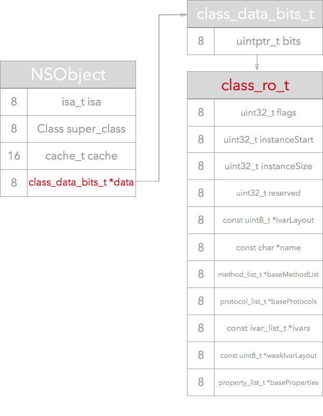
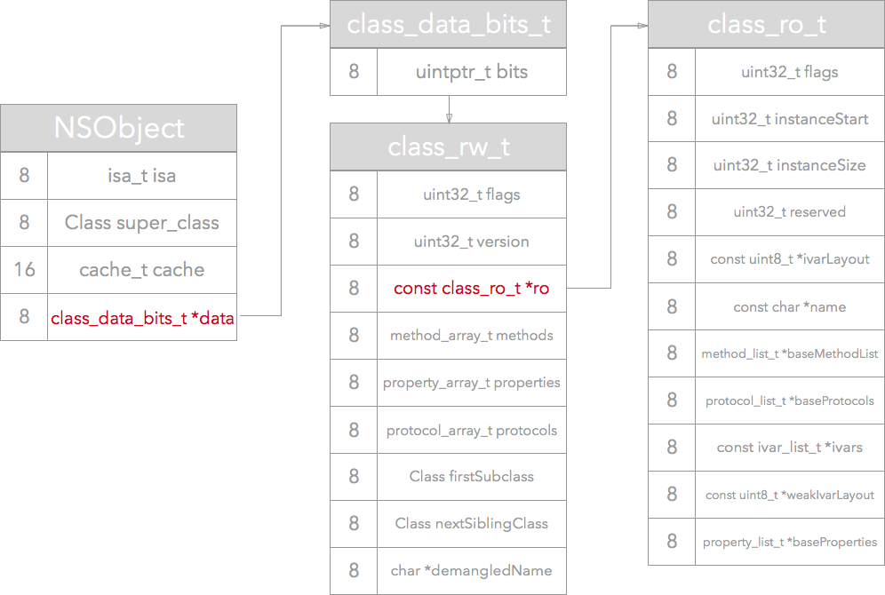

# Runtime

OC是一门动态性语言，允许很多操作在运行时进行操作

它的动态性是靠runtime进行实现，runtime是一套C语言的API,封装了很多动态性相关的函数

平时编写的OC代码，底层都是转成runtime api调用

### 具体应用

- 利用关联对象给分类添加属性
- 遍历类的所有成员变量（修改textfiled占位文字颜色、字典转模型、自动归档解档等）
- 交换方法（替换系统方法实现）
- 利用消息转发机制解决方法找不到的异常问题

### objc_class和objc_object

```c++
struct objc_object {
private:
    isa_t isa;
public:
	// function here
}

struct objc_class : objc_object {
    Class superclass;
    cache_t cache;             // formerly cache pointer and vtable
    class_data_bits_t bits;
  	// method here
}
```

- **objc_object** 定义在 `objc-private.h` 里面，该结构体只包含一个叫做 isa 的isa_t类型的变量

- **objc_class** 定义在 `objc-runtime-new.h` 里面，它继承自objc_object，所以除了isa成员变量之外，它还有：

  - 指向另一个objc_class结构体的指针 **super_class**；这一个objc_class包含了父类的信息

  - 一个包含函数缓存的cache_t类型变量 **cache**

  - 一个包含类的方法，属性等信息的class_data_bits_t类型的变量 **bits**

- 编译结束之后，OC的每个类都是以objc_class的结构体形式存在于内存之中，而且在内存中的位置已经固定。运行期间，创建新的对象的时候，也是创建objc_object的结构体

- 总结：OC的对象和类在内存中都是以结构体的形式存在的，类对应objc_class结构体，对象对应objc_object结构体。

  在创建这两种结构体的过程中都会初始化isa变量。isa变量存放着对象所属的类的信息，或者类所属的元类的信息。

  另外，在创建objc_class的结构体的时候还会初始化相应的cache和bits变量

### class_data_bits_t

```c++
struct class_data_bits_t {
    uintptr_t bits;	// 包含具体信息看下面表格
    // method here
}
```

| 名称            | 介绍                                                         |
| --------------- | ------------------------------------------------------------ |
| is_swift        | 第一个bit，判断类是否是Swift类                               |
| has_default_rr  | 第二个bit，判断当前类或者父类含有默认的`retain/release/autorelease/retainCount/_tryRetain/_isDeallocating/retainWeakReference/allowsWeakReference` 方法 |
| require_raw_isa | 第三个bit， 判断当前类的实例是否需要raw_isa                  |
| data            | 第4-48位，存放一个指向class_rw_t结构体的指针，该结构体包含了该类的属性，方法，协议等信息。 |

#### class_rw_t 和 class_ro_t

```c++
struct class_rw_t {
    uint32_t flags;
    uint32_t version;

    const class_ro_t *ro;

    method_array_t methods;
    property_array_t properties;
    protocol_array_t protocols;

    Class firstSubclass;
    Class nextSiblingClass;
};

struct class_ro_t {
    uint32_t flags;
    uint32_t instanceStart;
    uint32_t instanceSize;
    uint32_t reserved;

    const uint8_t * ivarLayout;

    const char * name;
    method_list_t * baseMethodList;
    protocol_list_t * baseProtocols;
    const ivar_list_t * ivars;

    const uint8_t * weakIvarLayout;
    property_list_t *baseProperties;
};
```

class_rw_t结构体内有一个指向class_ro_t结构体的指针。每个类都对应有一个class_ro_t结构体和一个class_rw_t结构体。在编译期间，class_ro_t结构体就已经确定，objc_class中的bits的data部分存放着该结构体的地址。在runtime运行之后，具体说来是在运行runtime的`realizeClass` 方法时，会生成class_rw_t结构体，该结构体包含了class_ro_t，并且更新data部分，换成class_rw_t结构体的地址。

类的`realizeClass`运行之前：



类的`realizeClass`运行之后：



细看两个结构体的成员变量会发现很多相同的地方，他们都存放着当前类的属性、实例变量、方法、协议等等。区别在于：class_ro_t存放的是编译期间就确定的；而class_rw_t是在runtime时才确定，它会先将class_ro_t的内容拷贝过去，然后再将当前类的分类的这些属性、方法等拷贝到其中。所以可以说class_rw_t是class_ro_t的超集，当然实际访问类的方法、属性等也都是访问的class_rw_t中的内容

### isa

- 在arm64架构之前，isa就是一个普通的指针，存储着Class、Meta-Class对象的内存地址
- 从arm64架构开始，对isa进行了优化，使用一个64位的共用体（union）结构存储数据，其中的33位存储内存地址，其余存储其他数据

```c++
union isa_t {
    Class cls;
    uintptr_t bits;
    struct {
    /*
        0，代表普通的指针，存储着Class、Meta-Class对象的内存地址
        1，代表优化过，使用位域存储更多的信息
    */
        uintptr_t nonpointer; 
        // 是否有设置过关联对象，如果没有，释放时会更快
        uintptr_t has_assoc;
        // 是否有C++的析构函数（.cxx_destruct），如果没有，释放时会更快
        uintptr_t has_cxx_dtor;
        // 存储着Class、Meta-Class对象的内存地址信息
        uintptr_t shiftcls;
        // 用于在调试时分辨对象是否未完成初始化
        uintptr_t magic;
        // 是否有被弱引用指向过，如果没有，释放时会更快
        uintptr_t weakly_referenced;
        // 对象是否正在释放
        uintptr_t deallocating;
        /*
            引用计数器是否过大无法存储在isa中
            如果为1，那么引用计数会存储在一个叫SideTable的类的属性中
        */ 
        uintptr_t has_sidetable_rc;
        // 里面存储的值是引用计数器减1
        uintptr_t extra_rc;
    }
}
```

### 消息转发机制

#### 消息发送

- 检测receiver(接收者)是否为nil,为nil退出
- receiver通过isa指针找到receiverClass
- receiverClass的cache中查找方法，找到调用方法，结束查找
- receiverClass的class_rw_t中查找方法,找到方法，调用方法并把方法缓存到receiverClass的cache中，结束查找。
- receiverClass通过superclass指针找到superClass，重复上面步骤

#### 动态分析

- 是否曾经有动态解析，有的话直接消息转发
- 调用+resolveInstanceMethod或+resolveClassMethod来动态解析方法
- 标记为已动态解析
- 动态解析过后，会重新走“消息发送”的流程(从receiverClass的cache中查找方法)

#### 消息转发

- 调用forwardingTargetForSelector:检测是否有备用接收者
  - 返回值不为nil,执行objc_msgSend(返回值, SEL)
  - 为nil，调用methodSignatureForSelector进行签名
    - 不为nil, 调用forwardInvocation:方法
    - 为nil，调用doesNotRecognizeSelector

### weak原理

- runtime维持了一个weak表；当一个对象obj被weak指针指向时，这个weak指针会以obj的指针作为key，存储到sideTable类的weak_table这个散列表上对应的一个weak指针数组里面。 当一个对象obj的dealloc方法被调用时，Runtime会以obj的指针为key，从sideTable的weak_table散列表中，找出对应的weak指针列表，然后将里面的weak指针逐个置为nil

```c++
struct SideTable {
    // 保证原子操作的自旋锁
    spinlock_t slock;
    // 引用计数的 hash 表
    RefcountMap refcnts;
    // weak 引用全局 hash 表
    weak_table_t weak_table;
}
struct weak_table_t {
    // 保存了所有指向指定对象的 weak 指针
    weak_entry_t *weak_entries;
    // 存储空间
    size_t    num_entries;
    // 参与判断引用计数辅助量
    uintptr_t mask;
    // hash key 最大偏移值
    uintptr_t max_hash_displacement;
}
```

